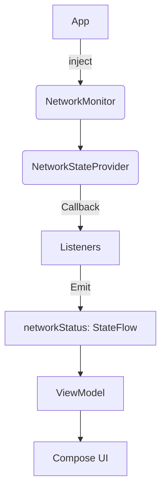

# 📡 NetworkMonitor – Android Network State Tracking (Clean Architecture)

## 📌 Purpose

`NetworkMonitor` helps you track network connectivity status (online/offline) in Android apps. It's built with clean architecture in mind and works well with ViewModel and Jetpack Compose.

---

## ⚙️ Initialization

### ✅ Using Dagger Hilt

```kotlin
@Module
@InstallIn(SingletonComponent::class)
object NetworkModule {

    @Provides
    @Singleton
    fun provideNetworkStateProvider(
        @ApplicationContext context: Context
    ): NetworkStateProvider {
        val cm = context.getSystemService(Context.CONNECTIVITY_SERVICE) as ConnectivityManager
        return NetworkStateProvider(
            context = context,
            coroutine = CoroutineScope(SupervisorJob() + Dispatchers.Main),
            connectivityManager = cm
        )
    }

    @Provides
    @Singleton
    fun provideNetworkMonitor(
        networkStateProvider: NetworkStateProvider
    ): NetworkMonitor = NetworkMonitor(networkStateProvider)
}
```

---

## 🚀 Usage in ViewModel

```kotlin
@HiltViewModel
class MainViewModel @Inject constructor(
    private val networkMonitor: NetworkMonitor
) : ViewModel() {
    val networkStatus = networkMonitor.networkStatus

    override fun onCleared() {
        super.onCleared()
        networkMonitor.stop() // Stop listening when ViewModel is destroyed
    }
}
```

---

## 🎨 Usage in Compose

```kotlin
@Composable
fun NetworkAwareScreen(viewModel: MainViewModel = hiltViewModel()) {
    val status by viewModel.networkStatus.collectAsState()

    when (status) {
        NetworkStatus.CONNECTED -> Text("✅ Online")
        NetworkStatus.DISCONNECTED -> Text("❌ Offline")
        NetworkStatus.INITIAL -> CircularProgressIndicator()
    }
}
```

---

## 🧠 NetworkStatus Enum

```kotlin
enum class NetworkStatus {
    INITIAL,
    CONNECTED,
    DISCONNECTED
}
```

---

## 🔧 Without Hilt (Manual Init)

You can initialize in `Application` class if you're not using Hilt:

```kotlin
class MyApplication : Application() {
    lateinit var monitor: NetworkMonitor

    override fun onCreate() {
        super.onCreate()
        val cm = getSystemService(Context.CONNECTIVITY_SERVICE) as ConnectivityManager
        val provider = NetworkStateProvider(
            context = this,
            coroutine = CoroutineScope(SupervisorJob() + Dispatchers.Main),
            connectivityManager = cm
        )
        monitor = NetworkMonitor(provider)
    }
}
```

---

## 📊 Architecture Diagram (Mermaid)



---

## ✅ Benefits

- ♻️ Seamless integration with ViewModel and Compose
- 📦 Easily injected with Hilt
- 📡 Avoids memory leaks, registers once
- 🔧 Flexible and testable

---

## 💬 Feedback

If you find `NetworkMonitor` useful, feel free to share or contribute ❤️
