# 📦 Dependency Injection Architecture (Hilt + Retrofit + Moshi)

This project is structured using Hilt for dependency injection, providing clean and modular setup for network communication.

## 🧱 Modules Overview

### ✅ MoshiModule
Provides a singleton Moshi instance for JSON serialization and deserialization.

### ✅ OkHttpModule
Provides:
- Logging Interceptor
- Header Interceptor
- Token Interceptor (for auth & refresh handling)
- OkHttpClient configured with all interceptors

### ✅ RetrofitModule
Provides:
- Base URL from `BuildConfig`
- MoshiConverterFactory
- Retrofit instance with all configuration
- API Services (e.g., `AuthService`, `RefreshTokenService`)

### ✅ ApiServiceProvider
Connects Retrofit instances to service interfaces via `retrofit.create(...)`.

### ✅ RetrofitProvider
Constructs a ready-to-use `Retrofit.Builder`.

### ✅ ConverterFactoryProvider
Provides Moshi-based `Converter.Factory` for Retrofit.

## 🧠 Architecture Diagram (Mermaid)

```mermaid
graph LR
    MoshiModule["📦 MoshiModule\nProvides Moshi instance"]
    OkHttpModule["🌐 OkHttpModule\nInterceptors + OkHttpClient"]
    RetrofitModule["🛠️ RetrofitModule\nRetrofit + Services"]
    ApiServiceProvider["🔌 ApiServiceProvider\nBinds Retrofit to API"]
    RetrofitProvider["🏗 RetrofitProvider\nBuilds Retrofit.Builder"]
    ConverterFactoryProvider["🔁 ConverterFactoryProvider\nProvides MoshiConverterFactory"]

    MoshiModule --> RetrofitModule
    OkHttpModule --> RetrofitModule
    ConverterFactoryProvider --> RetrofitModule
    RetrofitModule --> ApiServiceProvider
    RetrofitModule --> RetrofitProvider
```

## 🧪 Notes

- All modules are annotated with `@InstallIn(SingletonComponent::class)` meaning they are available app-wide.
- Interceptors are injected and chained in a safe and testable way.
- `TokenInterceptor` is capable of refreshing access tokens using a dedicated Retrofit instance.

---

Feel free to extend this architecture to support multiple base URLs, GraphQL, or other serialization mechanisms.
