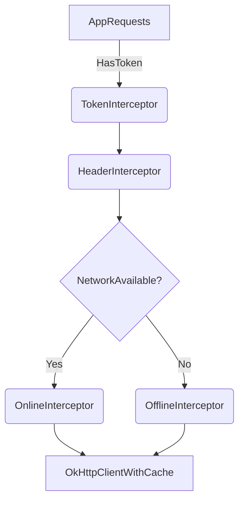

# 🧩 InterceptorModule – OkHttp Interceptor Configuration for Networking

This module provides a set of `OkHttp Interceptors` to support:

- ✅ Common request headers
- 🔐 Token-based authentication
- 📶 Intelligent offline/online caching
- ⚙️ Custom network behavior with Hilt DI

---

## 📦 Provided Interceptors

### 1. `HeaderInterceptor`

Automatically adds common headers (e.g., `Content-Type: application/json`) to every request.

```kotlin
@HeaderInterceptorAnnotation
fun provideHeaderInterceptor(): Interceptor
```

> Ensures all requests declare their body format, simplifying backend parsing.

---

### 2. `TokenInterceptor`

A custom interceptor that:
- Injects the `Bearer accessToken` into requests.
- Listens for `401` or `403` responses to **auto-refresh token**.
- Uses `SecureTokenLocalService` for local token storage.
- Calls `RefreshTokenService` when tokens expire.

```kotlin
@TokenInterceptorAnnotation
fun provideTokenInterceptor(): Interceptor
```

> Built on top of [Moshi] for safe token parsing and re-authentication.

---

### 3. `OfflineInterceptor`

Used to **serve cached responses when offline**.

```kotlin
@OfflineInterceptorAnnotation
fun provideOfflineInterceptor(): Interceptor
```

- Checks internet connectivity using `ConnectivityManager`.
- If offline:
  - Applies `CacheControl.onlyIfCached()` + `maxStale(7 days)`
  - Returns cached response if available.

✅ Perfect fallback for poor network environments.

---

### 4. `OnlineInterceptor`

Used when the device **is online** to ensure fresh data.

```kotlin
@OnlineInterceptorAnnotation
fun provideOnlineInterceptor(): Interceptor
```

- Forces request to **always fetch from server**:
  ```kotlin
  .noCache()
  ```

- Clears `Pragma` header to avoid legacy conflicts.

---

### 5. `Cache`

Defines a 10MB local cache directory used by OkHttp.

```kotlin
fun provideCache(): Cache
```

> Required for both online & offline interceptors to work properly.

---

## 🌐 Network Flow Summary



---

## 🛠 How to Use

Make sure your `OkHttpClient` is built like this (typically inside `NetworkModule.kt`):

```kotlin
OkHttpClient.Builder()
    .cache(cache)
    .addInterceptor(headerInterceptor)
    .addInterceptor(tokenInterceptor)
    .addInterceptor(offlineInterceptor)
    .addNetworkInterceptor(onlineInterceptor)
    .build()
```

---

## ✅ Dependencies

- [Moshi](https://github.com/square/moshi) – JSON parsing
- [OkHttp](https://square.github.io/okhttp/) – Network client
- Hilt – Dependency Injection
- Custom: `@*InterceptorAnnotation` for qualifying interceptors in Hilt

---

## 👨‍💻 Author

This setup was crafted with ❤️ by `Nguyễn Minh Hưng` for `PosNativeApp`'s client module.
