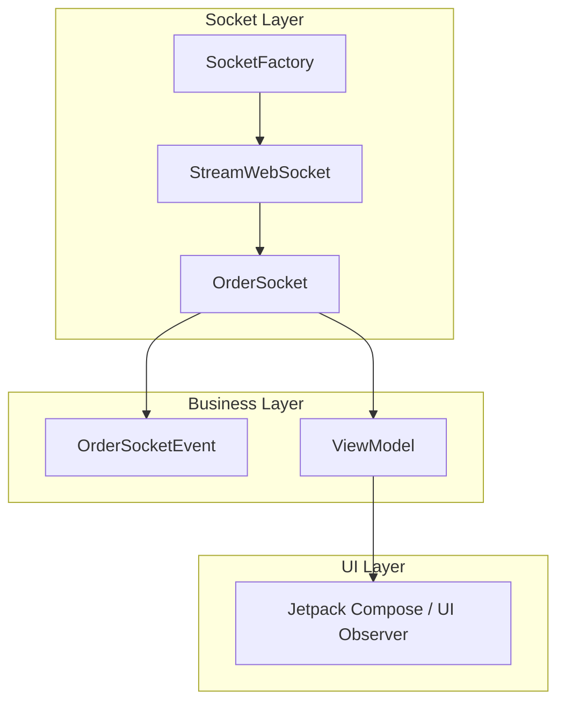

# 🧩 OrderSocket Architecture & Usage Guide

This document explains the architecture and usage of the `OrderSocket` module based on your implementation using Kotlin, OkHttp, and Coroutine Flow.

---

## 📐 Architecture Overview



- **SocketFactory**: Builds and configures `WebSocket` connections using OkHttp.
- **StreamWebSocket**: A wrapper to manage OkHttp `WebSocket` events and expose them via `Flow`.
- **OrderSocket**:
  - Converts raw messages to domain-specific events.
  - Handles reconnects, state management, and emits business events.
- **ViewModel**: Observes socket events and provides state for UI.

---

## 📦 Modules

### 1. `SocketFactory`

- Creates OkHttp `WebSocket` using `ConnectionArg` (anonymous/authenticated).
- Example usage:

```kotlin
val factory = SocketFactory()
val socket = factory.createSocket(ConnectionArg.AnnonyMounsConnection(...))
```

### 2. `StreamWebSocket`

- Manages low-level `WebSocketListener`.
- Emits `StreamSocketEvent` via `Flow`.

### 3. `OrderSocket`

- Accepts a `SocketFactory` and `ConnectionArg`.
- Emits `OrderSocketEvent` based on JSON message type.
- Supports reconnecting with retry.
- Methods:
  - `start()` to connect.
  - `stop()` to disconnect.
  - `sendOrderCreated(orderId, items)`
  - `sendOrderCancelled(orderId)`

---

## 🚀 How to Use

### Inject via Hilt (Example Module)

```kotlin
@Module
@InstallIn(SingletonComponent::class)
object OrderSocketModule {

    @Provides
    fun provideOrderSocket(): OrderSocket =
        OrderSocket(
            socketFactory = SocketFactory(),
            connectionArg = SocketFactory.ConnectionArg.AnnonyMounsConnection(
                endPoint = "wss://your-endpoint",
                apiKey = "api_key"
            )
        )
}
```

### Observe in ViewModel

```kotlin
@HiltViewModel
class OrderViewModel @Inject constructor(
    private val orderSocket: OrderSocket
) : ViewModel() {

    val state = MutableStateFlow("Idle")

    init {
        orderSocket.start()
        viewModelScope.launch {
            orderSocket.socketEvent.collect {
                when (it) {
                    is OrderSocketEvent.OrderCreated -> state.value = "New order: ${it.orderId}"
                    is OrderSocketEvent.OrderCancelled -> state.value = "Cancelled: ${it.orderId}"
                    is OrderSocketEvent.Error -> state.value = "Error: ${it.message}"
                }
            }
        }
    }

    override fun onCleared() {
        super.onCleared()
        orderSocket.stop()
    }
}
```

---

## 🧠 Best Practices

- Always call `stop()` in `onCleared()` to avoid memory leaks.
- Emit domain-level `OrderSocketEvent` instead of exposing raw socket JSON.
- Use exponential backoff (if needed) in reconnect logic.
- Use shared `CoroutineScope` with `SupervisorJob` and `Dispatchers.IO`.

---

## 📌 Extending Further

- Add `ping/pong` heartbeat for keep-alive.
- Support `Auth token` header injection.
- Introduce `SocketState` sealed class (Disconnected, Connecting, Connected).
- Persist socket messages using Room if offline required.

---

> Nguyen Minh Hung

