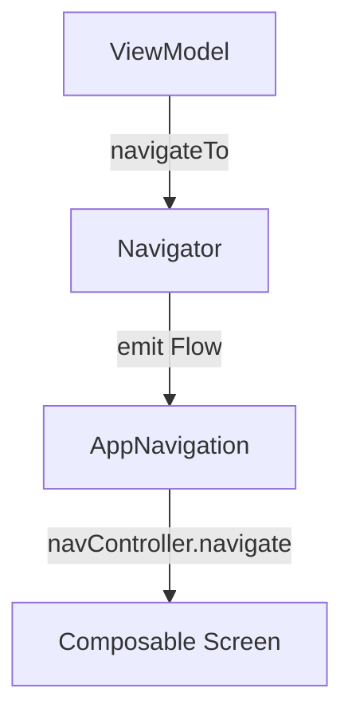

# 🚀 Navigation Module (Jetpack Compose + KSP-ready)

This module handles **declarative and type-safe navigation** for the app using:
- Jetpack Compose Navigation
- `NavDestination<T>` abstraction
- Pluginable `Navigator` class for viewmodel-safe routing

---

## 📐 Architecture Overview

### 🧱 Layers

```
ViewModel
   ↓
NavigationService (interface)
   ↓
Navigator (singleton)
   ↓
AppNavigation (NavHost)
   ↓
ScreenGraph (detailGraph, etc.)
   ↓
Composable Screens
```

### 📊 Flow Diagram



---

## 🏗️ Module Structure

```
navigation/
├── core/
│   ├── Navigator.kt             # SharedFlow-based Navigator
│   ├── NavigationService.kt     # Interface injected into VM
│   └── NavigationModule.kt      # Hilt bindings
│
├── graph/
│   ├── AppNavigation.kt         # Root NavHost
│   └── detailGraph.kt           # Nested graph (auth, order, product)
│
├── decorator/
│   ├── AppDecorator.kt          # Route constants
│   └── AppArgument.kt           # Nav argument keys
│
├── destination/
│   ├── NavDestination.kt        # Abstractions
│   ├── NodeScreen.kt            # Base interfaces
│   ├── WithoutArgsScreen.kt     # For static screens
│   └── ArgsScreen.kt            # For dynamic route screens
```

---

## 🧩 How It Works

### ✅ Navigator

- Emits navigation events via `SharedFlow`
- ViewModels use `NavigationService` to trigger navigation safely without context

```kotlin
navigator.navigateTo(ProductDetail.destination("123"))
```

---

### ✅ Destination Abstractions

#### 1. Without Args (static route)

```kotlin
object Auth : WithoutArgsScreen() {
    override val route = AppDecorator.AUTH
}
```

#### 2. With Args (e.g. productId)

```kotlin
object ProductDetail : ArgsScreen<String> {
    override val route = "${AppDecorator.PRODUCT_DETAIL}/{${AppArgument.PRODUCT_ID}}"
    override val arguments = listOf(navArgument(AppArgument.PRODUCT_ID) { type = NavType.StringType })

    override fun destination(arg: String) = "${AppDecorator.PRODUCT_DETAIL}/$arg"
    override fun objectParser(entry: NavBackStackEntry): String =
        entry.arguments?.getString(AppArgument.PRODUCT_ID) ?: ""
}
```

---

## ✳️ How to Add a New Screen

### ➕ Step 1: Define screen object

#### Without argument

```kotlin
object Profile : WithoutArgsScreen() {
    override val route = "profile"
}
```

#### With argument

```kotlin
object ChatDetail : ArgsScreen<String> {
    override val route = "chat/{chatId}"
    override val arguments = listOf(navArgument("chatId") { type = NavType.StringType })

    override fun destination(arg: String) = "chat/$arg"
    override fun objectParser(entry: NavBackStackEntry) =
        entry.arguments?.getString("chatId") ?: ""
}
```

---

### ➕ Step 2: Add to `YourGraph.kt`

```kotlin
composable(Profile.route) {
    screens.profile()
}

composable(ChatDetail.route, arguments = ChatDetail.arguments) {
    val chatId = ChatDetail.objectParser(it)
    screens.chat(chatId)
}
```

---

### ➕ Step 3: Add to `DetailScreen`

```kotlin
data class DetailScreen(
    val auth: @Composable () -> Unit,
    val order: @Composable () -> Unit,
    val productDetail: @Composable (String) -> Unit,
    val profile: @Composable () -> Unit,
    val chat: @Composable (String) -> Unit,
)
```

---

### ➕ Step 4: Navigate from ViewModel

```kotlin
navigator.navigateTo(ChatDetail.destination("abc123"))
```

---

## 🔐 ViewModel-safe Navigation

No need for `Context`, no leaks. Everything flows through:

- Interface `NavigationService`
- Emits to `SharedFlow`
- Collected in `NavHost` and executed safely on UI thread

---

## 🧪 Testability

You can easily mock `NavigationService` in ViewModel unit tests.

---

## 🧠 Designed For:

- 🧩 Multi-module navigation
- ✅ Type-safe route construction
- 🔄 Flow-based decoupled navigation

---
