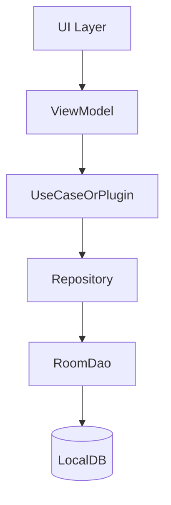

# 📦 Offline Module

This module is responsible for handling all **offline data storage** features such as:
- Room database
- DataStore preferences
- Repository & caching logic
- Plugin-based architecture (ex: CreateOrderListener)

---

## 🏗️ Folder Structure

```
offline/
├── dataStore/           # DataStore-based persistence (token, settings, etc.)
│   └── TokenLocalService.kt
│
├── di/                  # Dependency Injection (Hilt modules)
│   ├── DatabaseModule.kt
│   ├── DataStoreModule.kt
│   └── RepositoryModule.kt
│
├── extensions/          # Coroutine or flow extensions
│   └── CoroutineExtensions.kt
│
├── plugins/             # Custom plugins like CreateOrderListener (clean, decoupled)
│   └── (implementations go here)
│
├── repository/          # Room database logic
│   ├── database/
│   │   ├── converter/   # Type converters
│   │   ├── debug/       # Room logging utils
│   │   └── AppDatabase.kt
│   └── domain/
│       ├── order/
│       │   ├── DatabaseOrderRepository.kt
│       │   ├── OrderDao.kt
│       │   ├── OrderEntity.kt
│       │   └── OrderMapper.kt
│       └── product/
│           └── (WIP or placeholder)
│
├── utils/
│   └── Const.kt
```

---

## 🧩 Implementation Notes

### 🗂️ Repositories
- `DatabaseOrderRepository`: Implements data access for `Order`
- Uses `OrderDao`, `OrderMapper`, and `OrderEntity` to persist order data

### 🧠 Mapper Pattern
- Maps between domain models (used in business logic) and entity models (stored in Room DB)

### 🔐 DataStore
- `TokenLocalService` wraps the preferences layer (e.g. access token, user session info)

### 🧩 Plugins
- Follows a **plugin-based approach** like `CreateOrderListener`, where business events (create/delete/etc.) are handled cleanly and separately

---

## 🔄 Data Flow



---

## 🛠️ Dependency Injection (DI)

All required components are provided through `Hilt` modules:

- `DatabaseModule` → provides `RoomDatabase`, `Dao`s
- `DataStoreModule` → provides `DataStore` instance
- `RepositoryModule` → provides `DatabaseOrderRepository`, etc.

---

## 🧪 Test Support

Use `com.example.offline.androidTest` for integration test cases (e.g. insert/read order).  
Mock `TokenLocalService` or inject fake DAO for unit testing.

---

## ✅ Todo / Improvements

- Add `CreateOrderPlugin` into `plugins/`
- Add cache layer if needed using LruCache
- Define `ProductRepository` inside `domain/product/`
- Support for sync + conflict resolution layer

---

💡 **Designed with modularity and offline-first architecture in mind.**
